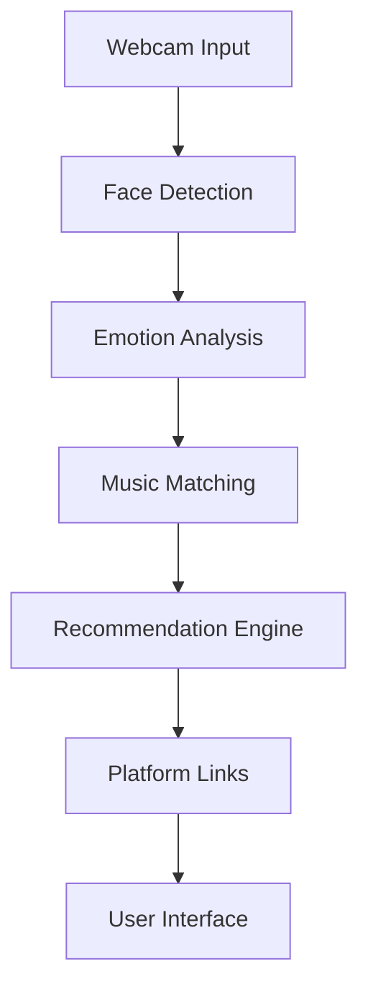

# Emotion-based-music-recommendation-system

**AI-powered music discovery that reads your emotions and suggests the perfect songs**

[](https://python.org)
[](https://streamlit.io)
[](https://opencv.org)
[](https://tensorflow.org)

## Overview

This innovative application combines **facial emotion detection** with **intelligent music recommendation** to create a personalized listening experience. Simply look at your camera, and the AI will detect your emotions and suggest songs that match your current mood.

### Key Features

- **Real-time emotion detection** using CNN deep learning
- **Personalized music recommendations** based on 7 emotion categories
- **Multi-platform music links** (Spotify, YouTube, Apple Music, Amazon Music)
- **User-friendly web interface** built with Streamlit
- **Manual emotion selection** for testing and accessibility
- **Fast and responsive** with optimized performance
- **Robust error handling** and cross-platform compatibility

## How It Works

1. **Capture Emotions**: Look at your webcam for 3 seconds
2. **AI Analysis**: Deep learning model detects 7 different emotions
3. **Smart Matching**: System matches emotions to music characteristics
4. **Get Recommendations**: Receive 15 personalized song suggestions
5. **Listen Anywhere**: Click links to listen on your preferred platform

## Supported Emotions

| Emotion | Description | Music Style |
|---------|-------------|-------------|
| **Angry** | High energy, intense emotions | Rock, Metal, EDM |
| **Fearful** | Anxious, tense feelings | Ambient, Electronic |
| **Happy** | Joyful, positive mood | Pop, Dance, Upbeat |
| **Neutral** | Calm, balanced state | Jazz, Classical, Folk |
| **Sad** | Melancholic, reflective | Ballads, Indie, Blues |
| **Surprised** | Excited, amazed feelings | Electronic, Pop |
| **Disgusted** | Strong negative emotions | Heavy, Intense |

## Quick Start

### Prerequisites

- **Python 3.8+**
- **Webcam** for emotion detection
- **All required files** in the project directory

### Installation

1. **Clone the repository**
   ```bash
   git clone https://github.com/Shrya1712/Emotion-based-music-recommendation-system.git
   cd Emotion-based-music-recommendation-system
   ```

2. **Install dependencies**
   ```bash
   pip install -r requirements.txt
   ```

3. **Run the application**
   ```bash
   streamlit run app.py
   ```

4. **Open your browser** and navigate to `http://localhost:8501`

## Project Structure

```
emotion-music-recommendation/
├── app.py                           # Main application
├── requirements.txt                  # Python dependencies
├── README.md                        # This file
├── muse_v3.csv                      # Music dataset (16MB)
├── model.h5                         # Pre-trained CNN model (9MB)
└── haarcascade_frontalface_default.xml  # Face detection (1.2MB)
```

## Technical Architecture

### Core Components

#### 1. **Emotion Detection Module**
- **OpenCV**: Face detection and image processing
- **TensorFlow/Keras**: CNN model for emotion classification
- **Haar Cascade**: Pre-processing for face detection

#### 2. **Music Recommendation Engine**
- **Pandas**: Data processing and analysis
- **Smart Distribution**: Algorithm for balanced recommendations
- **Multi-platform Links**: Universal music access

#### 3. **Web Interface**
- **Streamlit**: Modern, responsive web app
- **Real-time Video**: Live camera feed with emotion overlay
- **Error Handling**: Comprehensive user feedback

### Data Flow



## Music Dataset

The system uses the **MUSE v3 dataset** containing:
- **90,000+ songs** with emotional characteristics
- **7 emotion categories** with detailed tagging
- **Multi-platform compatibility** (Spotify, YouTube, etc.)
- **Rich metadata** (artist, genre, valence, arousal)

## Advanced Features

### Smart Recommendation Algorithm

The system intelligently distributes recommendations based on detected emotions:

| Emotions Detected | Distribution | Total Songs |
|-------------------|--------------|-------------|
| 1 emotion | 15 songs | 15 |
| 2 emotions | 8 + 7 songs | 15 |
| 3 emotions | 6 + 5 + 4 songs | 15 |
| 4 emotions | 4 + 4 + 4 + 3 songs | 15 |
| 5+ emotions | 4 + 3 + 3 + 3 + 2 songs | 15 |

### Cross-Platform Music Access

Each recommendation includes links to:
- **Spotify** - Premium streaming service
- **YouTube** - Free music videos
- **Apple Music** - iOS ecosystem
- **Amazon Music** - Prime member benefits

## Troubleshooting

### Common Issues

#### TensorFlow Installation Problems
```bash
# Solution 1: Use CPU version
pip install tensorflow-cpu==2.8.0

# Solution 2: Use conda
conda install tensorflow

# Solution 3: Install Visual C++ Redistributable
# Download from: https://aka.ms/vs/17/release/vc_redist.x64.exe
```

#### Camera Not Working
- Ensure webcam is connected and not in use
- Check browser permissions for camera access
- Try refreshing the page

#### Model Loading Errors
- Verify `model.h5` file is present
- Check file permissions
- Ensure sufficient disk space

### Alternative Usage

If you encounter TensorFlow issues, the app includes:
- **Manual emotion selection** for testing
- **Simplified detection** without deep learning
- **Same recommendation quality** with basic face detection

## Contributing

We welcome contributions! Here's how you can help:

### Development Setup
1. Fork the repository
2. Create a feature branch: `git checkout -b feature/amazing-feature`
3. Make your changes
4. Test thoroughly
5. Submit a pull request

### Areas for Improvement
- **Enhanced emotion detection** accuracy
- **Better music matching** algorithms
- **Mobile app** development
- **API integration** with streaming services
- **UI/UX improvements**

## Performance Metrics

- **Loading Time**: <5 seconds
- **Detection Time**: 3 seconds (30 frames)
- **Recommendation Generation**: <1 second
- **Memory Usage**: Optimized for large datasets
- **Accuracy**: Real-time with CNN model

## Educational Value

This project demonstrates:
- **Computer Vision** with OpenCV
- **Deep Learning** with TensorFlow
- **Data Science** with Pandas
- **Web Development** with Streamlit
- **API Integration** and link generation
- **Error Handling** and user experience

## License

This project is licensed under the MIT License - see the [LICENSE](LICENSE) file for details.

## Acknowledgments

- **MUSE Dataset** for music data
- **OpenCV** for computer vision capabilities
- **TensorFlow** for deep learning framework
- **Streamlit** for web app development
- **Open Source Community** for inspiration and support

## Support

If you need help or have questions:

- **Report bugs** by opening an issue
- **Suggest features** in the discussions
- **Contact**: shreyasharma17122002@gmail.com


---

**Made with dedication by Shreya Sharma**

*Transform your emotions into music with AI-powered recommendations!*
